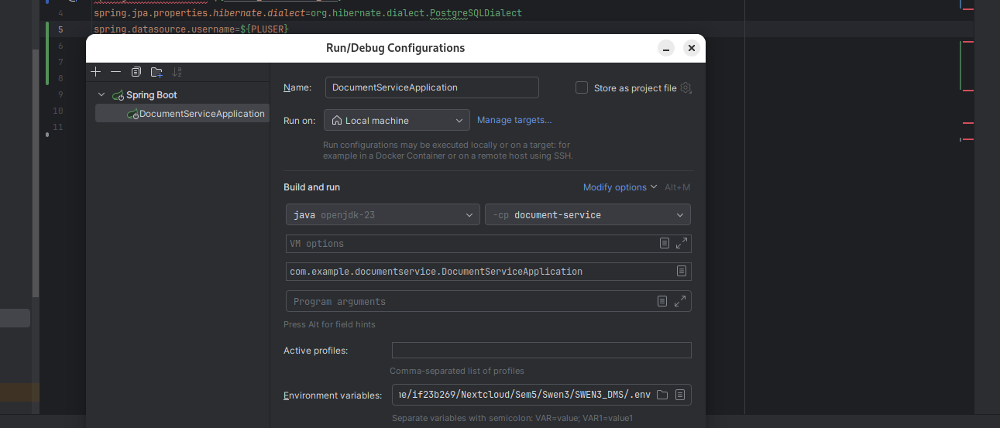

# Document Management System 
a Document management system for archiving documents in a FileStore,
with automatic OCR (queue for OC-recognition),
automatic summary generation (using Gen-AI),
tagging and full text search (ElasticSearch).

# Setup Guide

## 1. `.env` Datei anlegen

Lege im Projektverzeichnis eine Datei namens `.env` an (⚠️ nicht ins öffentliche Repo pushen) und füge die Werte ein.

```env
SPRING_DATASOURCE_URL=jdbc:postgresql://localhost:5432/paperless
# Postgres Superuser
POSTGRES_PASSWORD=# <- bitte ausfüllen
PLUSER=# <- bitte ausfüllen
PLUSER_PASSWORD=# <- bitte ausfüllen
PGADMIN_DEFAULT_EMAIL=# <- bitte ausfüllen
PGADMIN_DEFAULT_PASSWORD=# <- bitte ausfüllen
```

## 2. IntelliJ IDEA – Run/Debug Configuration

Öffne Run → Edit Configurations...

Wähle deine Spring Boot App (z. B. DocumentServiceApplication).

Unter Environment Variables:

Klick auf ... → Paste from Clipboard oder manuell eintragen.

IntelliJ kann .env direkt importieren (ab neueren Versionen), sonst direkt eingeben. 



## 3. Docker Compose starten

Stelle sicher, dass docker-compose.yml dein .env verwendet:

```bash
docker compose up -d
```
- Docker startet den Postgres-Container
- Init-Skripte werden automatisch ausgeführt

## 4. Spring Boot starten

Starte deine App in IntelliJ oder per Maven.


nur ein Vorschlag: 

## 🏗️ Projektstruktur

```plaintext
paperless-project/
│── docker-compose.yml         # startet alle Services
│── README.md                  # Projektübersicht
│── docs/                      # Architekturdiagramme, OpenAPI Spezifikationen
│── scripts/                   # Hilfsskripte für Setup/Deployment
│
├── web-ui/                    # PaperlessWebUI (nginx + frontend)
│   ├── Dockerfile
│   └── src/
│
├── rest-api/                  # PaperlessREST (Backend API)
│   ├── Dockerfile
│   ├── openapi.yml
│   └── src/
│
├── services/                  # PaperlessServices (Worker)
│   ├── Dockerfile
│   ├── ocr-worker/
│   │   └── src/
│   └── genai-worker/
│       └── src/
│
├── infra/                     # Infrastruktur-Config
│   ├── elasticsearch/
│   ├── minio/
│   ├── postgres/
│   ├── rabbitmq/
│   └── adminer/
│
└── .github/
    └── workflows/             # CI/CD Pipelines (z.B. GitHub Actions)
```
----------------------------------------------------------------------

# Kafka, REST, OCR-Worker (Sprint 3)

Dieser Stack startet mit einem Befehl Kafka (inkl. UI), Postgres, REST-Server, Web-UI und einen OCR-Worker-Stub (ein einfacher Kafka-Consumer).

Ziel/DoD: REST & OCR-Worker können sich verbinden.

Voraussetzungen

•	Docker Desktop (oder Docker Engine + Docker Compose)

•	PowerShell / Terminal

Kein lokales Kafka/Postgres/Node nötig – alles läuft in Containern.

# Schnellstart
    im Repo-Root starten:
    
        docker compose up -d

    Status & Ports:
    
        	docker compose ps
# URLs

•	Web-UI: http://localhost/

•	REST (extern): http://localhost:8082 → Health: /actuator/health

•	Kafka-UI: http://localhost:8081

•	pgAdmin: http://localhost:5050

Intern (im Compose-Netz) sprechen Services so miteinander:
Kafka: kafka:29092 · REST: paperless-rest:8080 · Postgres: postgres:5432

# Was startet?

| Service           | Zweck                                    | Ports (Host→Container) |
| ----------------- | ---------------------------------------- | ---------------------- |
| `kafka`           | Kafka (KRaft)                            | 9092→9092              |
| `kafka-ui`        | Kafka Management UI                      | 8081→8080              |
| `kafka-init`      | **Legt Topics automatisch an**           | –                      |
| `postgres`        | Datenbank + Init-Script/Healthcheck      | 5432→5432              |
| `pgadmin`         | Postgres UI                              | 5050→80                |
| `paperless-rest`  | REST-Backend (mit Kafka-Producer-Wiring) | **8082→8080**          |
| `paperless-webui` | Frontend                                 | 80→80                  |
| `ocr-worker`      | **Stub-Consumer** auf `doc.ocr`          | –                      |


# Kafka-Topics (Auto-Create)
Beim Start legt kafka-init die nötigen Topics idempotent an:

•	doc.ocr (Haupttopic)

•	doc.ocr.dlq (Dead-Letter, optional)

Prüfen:
docker exec -it kafka sh -lc "/opt/kafka/bin/kafka-topics.sh --bootstrap-server localhost:9092 --list"

erwartet: doc.ocr, doc.ocr.dlq

# Smoke-Tests
1) REST erreichbar


   
2) OCR-Worker hört zu


3) Test-Nachricht produzieren (simuliert „Upload → Publish“)


full command: docker exec -it kafka sh -lc "/opt/kafka/bin/kafka-console-producer.sh --bootstrap-server localhost:9092 --topic doc.ocr"

Dann eine Zeile eintippen (Enter schickt ab):


→ Die Zeile erscheint im ocr-worker-Log.
Damit ist die Verbindung Kafka ↔︎ Worker bestätigt.


# Nützliche Kommandos
 Logs ansehen:
 
    docker compose logs -f paperless-rest
    
    docker compose logs -f ocr-worker
    
    docker compose logs -f kafka-init

Stack stoppen:

    docker compose down

Vollständig zurücksetzen (inkl. Volumes/DB):

    docker compose down -v

# Konfiguration & Hinweise

•	Kafka Bootstrap (Container): kafka:29092

•    Kafka Bootstrap (Host-Tools): localhost:9092
    
•	REST extern auf 8082: Das Host-Port-Mapping ist 8082:8080.

•    Die Web-UI spricht das Backend im Compose-Netz über paperless-rest:8080 an (kein Browser-Port-Fix nötig).

•	pgAdmin Login: Standardwerte aus .env/Compose (siehe docker-compose.yml).


