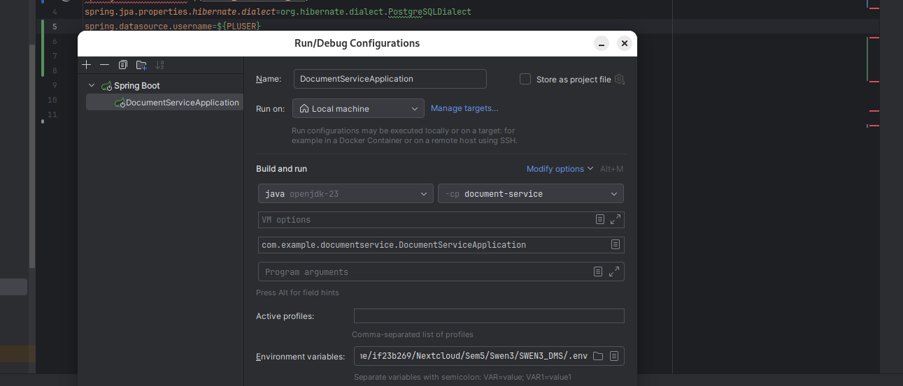

# Document Management System 
a Document management system for archiving documents in a FileStore,
with automatic OCR (queue for OC-recognition),
automatic summary generation (using Gen-AI),
tagging and full text search (ElasticSearch).

# Setup Guide

## 1. `.env` Datei anlegen

Lege im Projektverzeichnis eine Datei namens `.env` an (⚠️ nicht ins öffentliche Repo pushen) und füge die Werte ein.

```env
SPRING_DATASOURCE_URL=jdbc:postgresql://localhost:5432/paperless
# Postgres Superuser
POSTGRES_PASSWORD=# <- bitte ausfüllen
PLUSER=# <- bitte ausfüllen
PLUSER_PASSWORD=# <- bitte ausfüllen
PGADMIN_DEFAULT_EMAIL=# <- bitte ausfüllen
PGADMIN_DEFAULT_PASSWORD=# <- bitte ausfüllen
```

## 2. IntelliJ IDEA – Run/Debug Configuration

Öffne Run → Edit Configurations...

Wähle deine Spring Boot App (z. B. DocumentServiceApplication).

Unter Environment Variables:

Klick auf ... → Paste from Clipboard oder manuell eintragen.

IntelliJ kann .env direkt importieren (ab neueren Versionen), sonst direkt eingeben. 



## 3. Docker Compose starten

Stelle sicher, dass docker-compose.yml dein .env verwendet:

```bash
docker compose up -d
```
- Docker startet den Postgres-Container
- Init-Skripte werden automatisch ausgeführt

## 4. Spring Boot starten

Starte deine App in IntelliJ oder per Maven.


nur ein Vorschlag: 

## 🏗️ Projektstruktur

```plaintext
paperless-project/
│── docker-compose.yml         # startet alle Services
│── README.md                  # Projektübersicht
│── docs/                      # Architekturdiagramme, OpenAPI Spezifikationen
│── scripts/                   # Hilfsskripte für Setup/Deployment
│
├── web-ui/                    # PaperlessWebUI (nginx + frontend)
│   ├── Dockerfile
│   └── src/
│
├── rest-api/                  # PaperlessREST (Backend API)
│   ├── Dockerfile
│   ├── openapi.yml
│   └── src/
│ 
├── services/                  # PaperlessServices (Worker)
│   ├── Dockerfile
│   ├── ocr-worker/
│   │   └── src/
│   └── genai-worker/
│       └── src/
│ 
├── infra/                     # Infrastruktur-Config
│   ├── elasticsearch/
│   ├── minio/
│   ├── postgres/
│   ├── rabbitmq/
│   └── adminer/ 
│ 
└── .github/ 
    └── workflows/             # CI/CD Pipelines (z.B. GitHub Actions)
```
